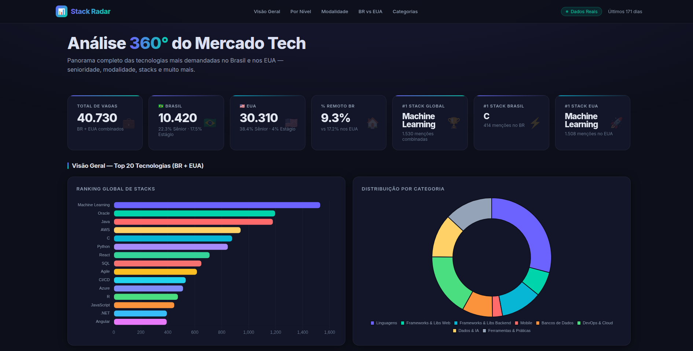
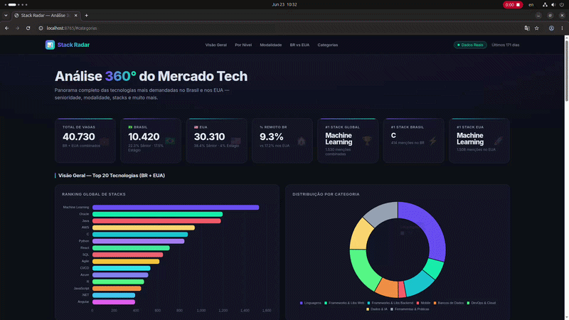

# 📊 Stack Radar

> **Análise 360° do Mercado de Tecnologia (Brasil vs. EUA)**



O **Stack Radar** é uma ferramenta para analisar e comparar as tecnologias mais demandadas no mercado de tecnologia do **Brasil (🇧🇷)** e dos **Estados Unidos (🇺🇸)** por senioridade (Junior, Pleno, Sênior, Estágio) e modalidade (Remoto, Híbrido, Presencial), consumindo dados reais da API da Adzuna.

---

## 📺 Demonstração



---

## 🔄 Como Funciona o Fluxo?

O projeto é dividido em três etapas integradas:

1. **Coleta e Processamento (`script.py`)**: Busca vagas de desenvolvimento na API da Adzuna, classifica-as por senioridade e modalidade de trabalho, e gera uma planilha rica e formatada em Excel (`analise_mercado_br_eua.xlsx`).
2. **Preparação dos Dados (`generate_data.py`)**: Lê os dados consolidados da planilha e gera o arquivo `data.json` estruturado.
3. **Visualização (`index.html`)**: Dashboard interativo em HTML/CSS/JS (Vanilla) que consome o `data.json` e renderiza gráficos dinâmicos usando **Chart.js**.

---

## 🚀 Principais Funcionalidades do Dashboard

- **Visão Global & Comparativa**: Comparativo direto das tecnologias mais demandadas no Brasil vs. Estados Unidos.
- **Filtro por Senioridade**: Detalhamento das tecnologias mais exigidas para Estágio, Júnior, Pleno e Sênior.
- **Distribuição de Modalidade**: Proporção exata de vagas Remotas, Híbridas e Presenciais por país.
- **Divisão por Categoria de Stack**: Agrupamento automático em Linguagens, Frameworks Frontend/Backend, Mobile, Dados & IA, DevOps & Cloud, etc.

---

## 🛠️ Tecnologias Utilizadas

- **Pipeline de Dados**: Python 3 (Requests, Pandas, Openpyxl, Regex, ThreadPoolExecutor)
- **Frontend / Dashboard**: HTML5, CSS3 (Vanilla), JavaScript (Vanilla) e [Chart.js](https://www.chartjs.org/)

---

## ⚙️ Como Executar Localmente

### 1. Clonar o Repositório

Clone o repositório git e entre na pasta do projeto:
```bash
git clone https://github.com/Jadson-Js/stack-radar.git
cd stack-radar
```

### 2. Configurar Credenciais

Crie um arquivo `.env` na raiz do projeto com as suas chaves de acesso obtidas no painel de desenvolvedor da [Adzuna](https://developer.adzuna.com/):

```env
APP_ID=seu_app_id
APP_KEY=sua_app_key
```

### 3. Instalar Dependências

Instale as dependências Python necessárias:

```bash
pip install requests pandas openpyxl python-dotenv
```

### 4. Rodar o Pipeline de Dados

Execute a extração e conversão dos dados:

```bash
# 1. Busca os dados da API e exporta para o Excel
python script.py

# 2. Lê a planilha Excel e gera o data.json para o frontend
python generate_data.py
```

_(Nota: O dashboard consome diretamente o arquivo `data.json` na raiz do projeto)._

### 5. Abrir o Dashboard

Abra o arquivo `index.html` diretamente no seu navegador ou inicie um servidor local (ex: extensão Live Server do VS Code) para visualizar e interagir com os gráficos.
